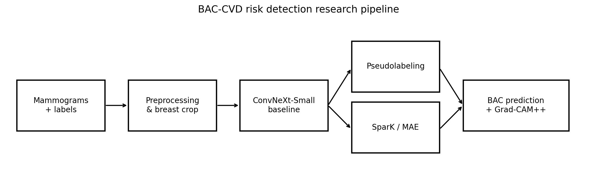
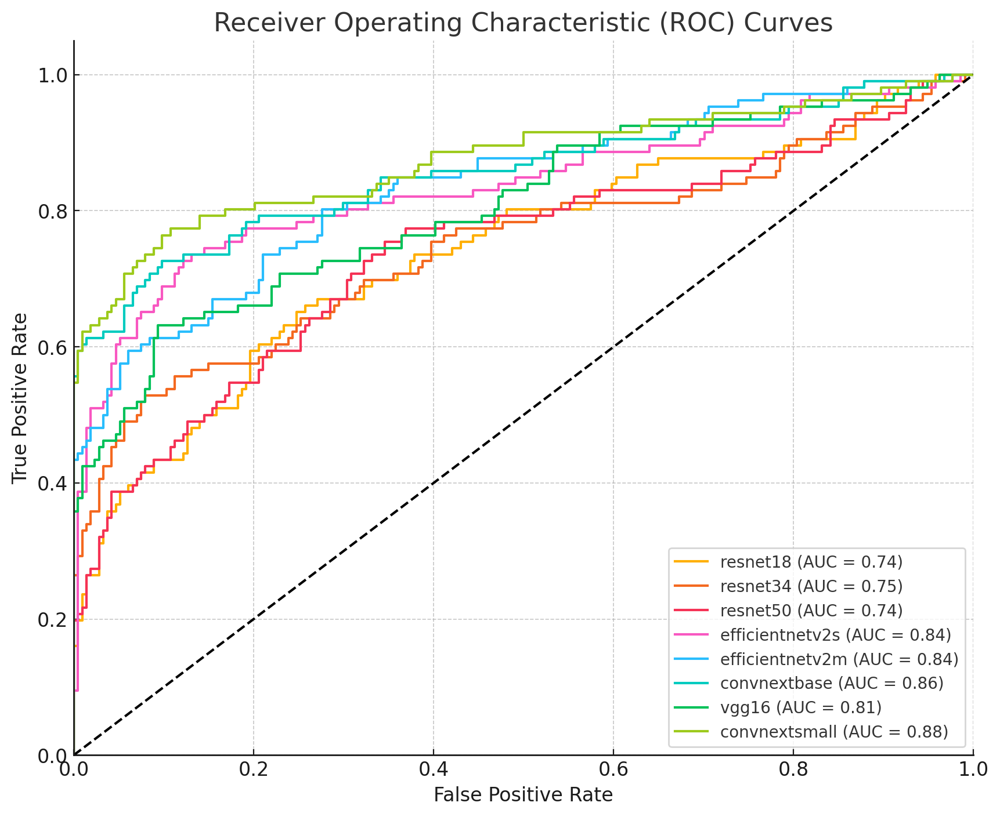
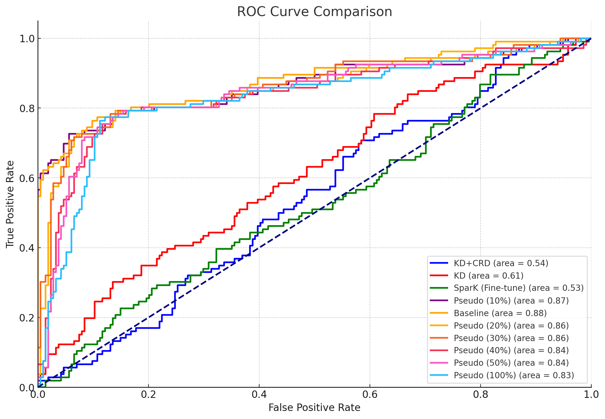

# BAC-CVD-Risk-Detection

Deep-learning research for **Breast Arterial Calcification (BAC)
detection in mammograms**, investigated as a potential imaging biomarker
for cardiovascular disease (CVD) risk.

This repository contains the experimental pipelines developed around the
associated master's thesis. The project is organized around one common
question: how can BAC classification be improved when expert-labeled
mammograms are scarce but unlabeled mammograms are available?

The repository includes:

-   supervised transfer learning;
-   semi-supervised learning through pseudolabeling;
-   knowledge distillation (KD) and contrastive representation
    distillation (CRD);
-   self-supervised pretraining with SparK / Masked Autoencoders;
-   Grad-CAM++ explainability.

> **Research status:** this is an experimental research repository, not
> a clinical decision-support system. The underlying mammography
> dataset, patient metadata, trained checkpoints and experiment outputs
> are not publicly released.

## Start here

Choose the pipeline that matches the experiment you want to reproduce:

| Pipeline | Purpose | Entry point |
| --- | --- | --- |
| [Vanilla pretrained](vanilla-pretrained/README.md) | Supervised ImageNet transfer-learning baseline | `train_caller.py`, `test_caller.py` |
| [Knowledge distillation](knowledge-distillation/README.md) | Teacher-to-student transfer with KD, CRD and related losses | `train_teacher.py`, `train_student.py` |
| [Self-supervised learning](self-supervised-learning/README.md) | Unlabeled-image pretraining followed by BAC fine-tuning | `Pre-Training/`, `Downstream/` |

Before running any pipeline, read [the reproducibility guide](docs/REPRODUCIBILITY.md).
It defines the data boundary, environment variables, output policy and
validation levels used throughout the project.

------------------------------------------------------------------------

## Research at a glance

### Problem

Breast arterial calcifications are visible on mammograms and may provide
additional information about cardiovascular risk in women. Detecting
BACs is challenging because they can be subtle, diffuse and visually
confounded by other types of calcifications.

The project investigates whether a deep-learning classifier can identify
BAC-positive mammograms using **image-level labels only**, without
requiring BAC segmentation or bounding-box annotations.

### Approach

The study compares a conventional supervised baseline with approaches
designed to exploit additional unlabeled mammography data.



------------------------------------------------------------------------

## Key Results

The strongest supervised model was **ConvNeXt-Small**.

| Experiment | AUC-ROC | Notes |
|---|---:|---|
| **ConvNeXt-Small — 3-fold CV** | **0.88** | Best supervised model |
| **ConvNeXt-Small — grouped aggregation** | **0.91** | Mean probability across images from the same patient/exam |
| Pseudolabeling — 10% | 0.87 | Best pseudolabeling configuration |
| Pseudolabeling — 20% | 0.86 | — |
| Pseudolabeling — 30% | 0.86 | — |
| Pseudolabeling — 40% | 0.84 | — |
| Pseudolabeling — 50% | 0.84 | — |
| Pseudolabeling — 100% | 0.83 | Performance decreased with more noisy labels |
| Knowledge Distillation | 0.61 | Below baseline |
| KD + CRD | 0.54 | Below baseline |
| SparK / MAE | 0.50 | Good reconstruction, weak downstream transfer |

For **ConvNeXt-Small**, grouped aggregation also achieved an **AUC-PR of 0.90**.

### Result provenance

The values above are reported thesis results, not metrics generated from
the public repository with a bundled dataset or checkpoint. The
evaluation levels must not be conflated:

| Result | Evaluation level | Thesis provenance | Public-repository status |
| --- | --- | --- | --- |
| ConvNeXt-Small AUC-ROC 0.88 | Image-level, stratified 3-fold CV | Supervised model comparison | Code exists; private data and exact run artifacts are unavailable |
| ConvNeXt-Small AUC-ROC 0.91 / AUC-PR 0.90 | Grouped aggregation of image predictions | Aggregated patient/exam evaluation in the thesis | The current helper groups by `patient_id`; the exact thesis grouping and reported run cannot be reproduced publicly |
| Pseudolabeling AUC-ROC 0.87 to 0.83 | Image-level BAC evaluation | 10% to 100% pseudo-label fractions | Filtering and merge inputs are private and no single end-to-end command is committed |
| KD, KD + CRD and SparK | Downstream BAC evaluation | Thesis comparison experiments | Adapted code is present, but the thesis-specific paths require manual setup |

The public code should therefore be treated as an implementation reference
and experiment archive rather than a turnkey reproduction package.

### Supervised model comparison


The mean AUC-ROC values reported for the evaluated architectures show
ConvNeXt-Small as the strongest supervised configuration, followed
closely by EfficientNetV2-M.

The thesis ROC curves provide the corresponding view across operating
points:



*Source: thesis Figure 9. This is a thesis-derived figure and is included
for reference; it was not regenerated from the public repository. Its
curve legend reflects the plotted thesis run and is not a replacement for
the mean values summarized in the table above.*

The thesis also reports the following ConvNeXt-Small holdout confusion
matrix:


*Source: thesis Figure 10. Counts depend on the private holdout split and
should not be interpreted as a new public benchmark.*

------------------------------------------------------------------------

## Learning from unlabeled mammograms

A major part of the study explored how the much larger unlabeled
mammography collection could be exploited.

### Pseudolabeling

The ConvNeXt-Small baseline was used to assign pseudo-labels to the
unlabeled `mammo 5000` dataset. Different fractions of the
pseudo-labeled images were incorporated into training.

The thesis retained predictions below 0.2 or above 0.8 as confident
pseudo-labels before constructing the training subsets. The public
repository does not include the source checkpoint, the generated
prediction CSV or a complete command that creates every 10%--100%
subset; these steps must be recreated with authorized data and recorded
configuration.


The best configuration used **10% of the available pseudolabeled images
(AUC-ROC 0.87)**. Performance progressively decreased as more
pseudo-labels were introduced, reaching 0.83 when all available
pseudo-labeled images were used.

This suggests that **pseudo-label quality is more important than simply
maximizing the amount of additional data**.

### Figure provenance

The figures in `docs/assets/` summarize the thesis experiments. They are
thesis-derived research communication assets, not newly generated
benchmarks from the public worktree. Any regenerated figure must include
the source table/run and configuration used; see [`docs/README.md`](docs/README.md).

------------------------------------------------------------------------

## Knowledge distillation

The project also investigated transferring information from the
ConvNeXt-Small teacher to a student network.

Two approaches were evaluated:

-   **Knowledge Distillation (KD)** --- matching the teacher's softened
    output distribution;
-   **Contrastive Representation Distillation (CRD)** --- encouraging
    agreement between teacher and student representations.

The experiments achieved:

-   KD: **AUC-ROC 0.61**
-   KD + CRD: **AUC-ROC 0.54**

Neither approach matched the supervised ConvNeXt-Small baseline.

------------------------------------------------------------------------

## Self-supervised learning with SparK

SparK was investigated as a Masked Autoencoder-style self-supervised
pretraining strategy.

The model was pretrained on the unlabeled mammography dataset by masking
image patches and reconstructing the missing content, then evaluated on
the BAC task.

The reported reconstruction loss was **0.00089**, but downstream BAC
classification reached only **AUC-ROC 0.50**.

This is an important negative result: strong reconstruction quality did
**not** automatically translate into useful representations for BAC
classification. The thesis therefore identifies longer/more optimized
pretraining and further experimentation as important future directions.

The committed SparK code is not currently a self-contained BAC
reproduction path: its entry point imports a missing local
`utils.arg_util` module, and its dataset wrapper expects an ImageNet-style
`train/` and `val/` directory layout. The downstream notebooks currently
contain inherited Brain, COVID-19 and OrgMNIST examples rather than a
committed BAC-specific notebook. Treat this area as experimental source
code until those dependencies and adaptations are supplied.

------------------------------------------------------------------------

## Overall comparison


The experiments show a clear distinction between the **best-performing
supervised solution** and the investigated unlabeled-data strategies.

Rather than demonstrating that every semi/self-supervised method
improves performance, the study provides a more useful research
conclusion:

> **For this dataset and experimental setup, the supervised
> ConvNeXt-Small baseline remained the strongest approach.**

The pseudolabeling experiments came closest to the baseline, while
KD/CRD and the SparK configuration investigated here did not reach
comparable downstream performance.

The thesis ROC comparison makes this result explicit:



*Source: thesis Figure 15. The plotted curves are thesis results, not
outputs from a bundled dataset or checkpoint.*

------------------------------------------------------------------------

## Dataset

The study used three mammography subsets provided by ScreenPoint
Medical:

  Subset             Exams   Images Description
  ---------------- ------- -------- -----------------------------------
  `exams no bac`       250      860 Expert-labeled BAC-negative exams
  `exams bac`          162      713 Expert-labeled BAC-positive exams
  `mammo 5000`       5,000   20,071 Unlabeled screening mammograms

The labeled dataset therefore contains **412 exams and 1,573 images**,
while `mammo 5000` provides a substantially larger pool of unlabeled
images.

The labeled subsets originate from mammograms acquired in the
Netherlands, Germany and Sweden; the unlabeled `mammo 5000` dataset
originates from Switzerland.

The datasets contain images from multiple mammography vendors, providing
some degree of acquisition diversity.

> The original clinical images and patient-level metadata are not
> included in this public repository.

------------------------------------------------------------------------

## Preprocessing

The preprocessing pipeline was designed to standardize mammograms while
retaining the visual information required for BAC detection.

### Main steps

1.  DICOM-to-image preprocessing.
2.  16-bit grayscale extraction.
3.  Window/level processing.
4.  Resampling to a standardized pixel size.
5.  Conversion to 8-bit grayscale PNG.
6.  Breast segmentation using a Felzenszwalb-based approach.
7.  Breast bounding-box extraction and cropping.
8.  Resizing to approximately **1120 × 576** for model training.

The final input resolution was selected as a compromise between
bounding-box coverage and computational cost.

------------------------------------------------------------------------

## Experimental protocol

### Cross-validation

The labeled dataset was evaluated using **stratified 3-fold
cross-validation**.

Crucially, splitting was performed at the **patient level**, ensuring
that different views from the same patient could not leak into different
folds.

For grouped evaluation, predictions from multiple images were aggregated
by averaging their probabilities. The thesis discusses patient/exam
aggregation, while the checked-in helper currently groups by
`patient_id`; verify the grouping identifier before comparing a new run
with the reported 0.91/0.90 result.

### Final holdout

After model selection, the best configurations were retrained using a
stratified patient-level:

-   70% training;
-   10% validation;
-   20% test

split.

### Training

The main supervised configuration used:

-   Adam optimizer;
-   initial learning rate: `1e-6`;
-   cosine annealing;
-   batch size: `8`;
-   weighted binary cross-entropy;
-   horizontal-flip augmentation;
-   maximum 60 epochs;
-   early stopping with patience 10.

### Evaluation metrics

The primary metrics were:

-   **AUC-ROC** --- overall discriminative ability;
-   **AUC-PR** --- particularly relevant for the imbalanced BAC-positive
    class.

------------------------------------------------------------------------

## Explainability

Because this is a medical-imaging problem, model interpretability was
investigated using **Grad-CAM++**.

The thesis reports examples covering:

-   true positives with high BAC burden;
-   true positives with small BACs;
-   true negatives with confounding factors;
-   false positives where small calcifications were mistaken for BAC.

Grad-CAM++ provides a visual indication of the image regions influencing
the model's prediction and can therefore be used to inspect whether the
classifier is focusing on clinically plausible areas.

> Patient images are intentionally not reproduced in this public
> repository unless they have been appropriately de-identified and
> cleared for publication.

------------------------------------------------------------------------

## Repository structure

``` text
BAC-CVD-Risk-Detection/
├── vanilla-pretrained/
│   ├── src/config/
│   ├── src/
│   ├── train_caller.py
│   └── test_caller.py
│
├── knowledge-distillation/
│   ├── dataset/
│   ├── distiller_zoo/
│   ├── crd/
│   ├── helper/
│   ├── train_teacher.py
│   └── train_student.py
│
├── self-supervised-learning/
│   ├── Pre-Training/
│   └── Downstream/
│
├── docs/
│   ├── assets/
│   │   ├── research_pipeline.png
│   │   ├── supervised_model_comparison.png
│   │   ├── pseudolabeling_performance.png
│   │   ├── learning_strategy_comparison.png
│   │   ├── thesis_supervised_roc.png
│   │   ├── thesis_convnext_confusion_matrix.png
│   │   └── thesis_learning_strategies_roc.png
│   └── REPRODUCIBILITY.md
│
├── CONTRIBUTING.md
├── SECURITY.md
├── CITATION.cff
└── README.md
```

The repository combines the three experimental pipelines while
preserving their methodological origins. The knowledge-distillation and
self-supervised-learning components were adapted from public research
implementations to work with the mammography dataset and the BAC
classification task.

------------------------------------------------------------------------

## Reproducibility

The complete experimental dataset cannot be distributed publicly. The
pipeline READMEs describe expected layouts and commands, but they do not
provide data, credentials or checkpoints.

To reproduce the experiments, an authorized user needs:

1.  access to a compatible mammography dataset;
2.  the expected CSV metadata format;
3.  the preprocessing pipeline;
4.  the required Python environment;
5.  model checkpoints when reproducing downstream experiments.

Use the pipeline-specific READMEs and `docs/REPRODUCIBILITY.md` for
environment variables, data paths and execution instructions.

Do not commit:

-   patient images;
-   patient metadata;
-   private checkpoints;
-   local filesystem paths;
-   credentials or API keys;
-   unverified experiment outputs.

------------------------------------------------------------------------

## Research questions

The project was structured around three main questions:

1.  **How well can modern pretrained architectures detect BACs from
    mammograms using image-level labels?**
2.  **Can unlabeled mammograms improve performance through
    pseudolabeling or knowledge distillation?**
3.  **Can self-supervised representation learning exploit the larger
    unlabeled dataset to improve downstream BAC classification?**

The experiments suggest that architecture choice and pseudo-label
quality are critical, while the investigated KD/CRD and SparK
configurations require further optimization.

------------------------------------------------------------------------

## Limitations

Several limitations should be considered when interpreting the results:

-   The labeled dataset is relatively small for deep-learning medical
    imaging.
-   The datasets come from different acquisition environments and
    vendors, which can introduce distributional effects.
-   Pseudolabeling can propagate teacher errors into the training set.
-   The investigated SparK configuration was computationally demanding
    and therefore limited the breadth of pretraining experiments.
-   The study evaluates technical model performance rather than clinical
    outcomes.
-   External validation on independent cohorts and real-world clinical
    evaluation are still required.

Accordingly, the reported AUC values should **not** be interpreted as
evidence of clinical effectiveness.

------------------------------------------------------------------------

## Future work

The most relevant next steps identified by the study are:

-   improve pseudo-label generation and confidence calibration;
-   investigate iterative or uncertainty-aware pseudolabeling;
-   optimize self-supervised pretraining specifically for mammography;
-   explore longer and better-tuned SparK pretraining;
-   investigate more efficient architectures;
-   perform external validation on independent populations;
-   conduct prospective/large-scale clinical studies;
-   investigate BAC quantification and localization rather than
    classification alone.

------------------------------------------------------------------------

## Research contribution

The main contribution of this repository is not a single novel
neural-network architecture. Instead, it provides an **end-to-end
experimental comparison of multiple learning strategies for BAC
classification under limited annotation availability**.

In particular, the work combines:

-   medical-image preprocessing;
-   patient-level experimental design;
-   transfer learning;
-   semi-supervised learning;
-   knowledge distillation;
-   self-supervised learning;
-   model explainability;
-   reproducible experiment organization.

This makes the repository useful as a technical case study of how
different deep-learning strategies behave when **expert-labeled medical
imaging data are scarce but unlabeled data are abundant**.

------------------------------------------------------------------------

## Credits

The project was developed in collaboration with **ScreenPoint Medical**,
which provided the mammography data and research environment.

The knowledge-distillation component builds upon
[RepDistiller](https://github.com/HobbitLong/RepDistiller), and the
self-supervised component builds upon
[SSL-MedicalImaging-CL-MAE](https://github.com/Wolfda95/SSL-MedicalImagining-CL-MAE).
Their dataloaders, preprocessing, training and downstream paths were
adapted for the BAC mammography task. The original methods and authors
remain part of the scientific provenance of the implementations.

Please consult the pipeline-specific documentation and citation files
for the original methods and their respective authors.

------------------------------------------------------------------------

## Citation

If you use this repository or build upon the experimental work, please
cite the associated thesis/research work and the original methods used
in the individual pipelines.

See `CITATION.cff` for the repository citation metadata.

------------------------------------------------------------------------

## Disclaimer

This repository contains research code for experimental purposes only.

It is **not a medical device**, does not provide cardiovascular risk
scores, and must not be used to make clinical decisions about individual
patients.
